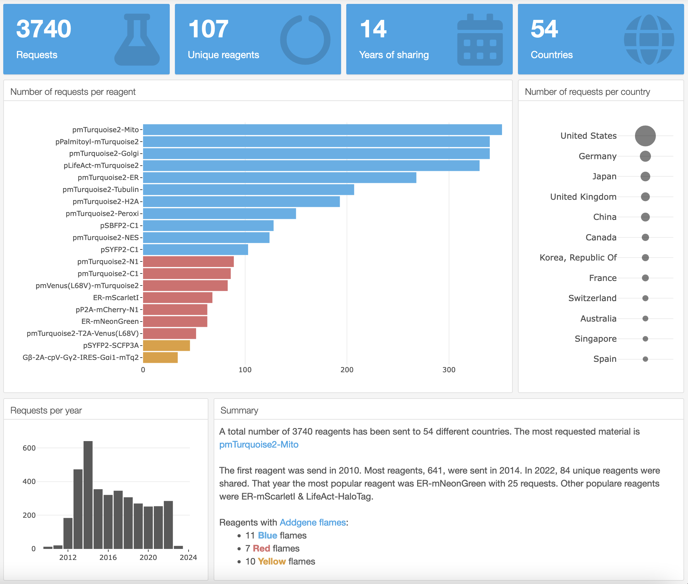

# Addgene Dashboard

 A dashboard to display plasmid request data from [Addgene](http://www.addgene.org)

Depositors can download an overview of requests for their deposited plasmids, see [this how-to](https://help.addgene.org/hc/en-us/articles/206135605-I-am-a-PI-who-has-deposited-with-Addgene-How-can-I-track-my-deposits-and-see-which-labs-have-requested-them-).

The dashboard aims to provide a quick overview of the data. To this end, upload the .csv with the plasmid request data, and the dashboard provides a summary of the statistics.

You can run the dashboard locally in Rstudio after downoading the [Addgene_dashboard.Rmd](https://github.com/JoachimGoedhart/Addgene_dashboard/blob/main/Addgene_dashboard.Rmd) file or use it online at this site: [https://amsterdamstudygroup.shinyapps.io/Addgene_dashboard/](https://amsterdamstudygroup.shinyapps.io/Addgene_dashboard/)

----------

The default output of the dashboard looks like this:

